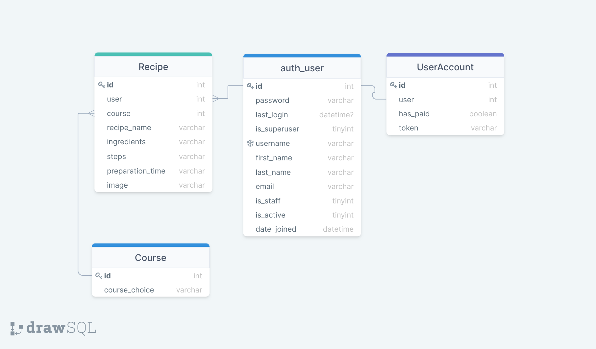

## Contents
- [My Recipe Book site](#my-recipe-book-site)
- [UX](#ux)
- [Database Schema](#database-schema)
- [Technologies Used](#technologies-used)
- [Testing](#testing)
- [Deployment](#deployment)
- [Credits](#credits)

# My Recipe Book website 
My Recipe Book represents a full-stack web application that uses the relational database PostgreSQL, the Django full stack MVC framework. The project also includes setup of the authentication mechanism and checkout system. With permission from Code Institute the idea for this project was taken from the MS3 study project with the goal to improve My Recipe book website by simplifying it (e.g. course pages are deprecated) and extedning with the new functionality.


# UX

## Who is this website for?
For users who want to create and manage their recipes online.

## What it is that they want to achieve?
They need a simple way to write down new cooking recipes in an online recipe book, be able to find them, edit or delete.

## How does the project fulfil the users’ needs?
The implementation provides intuitive user interface for creation of new recipes. The website requests users to be authenticated and authorised in order to manage their own recipes. Add recipe page lists all necessary fields for writing a new recipe, e.g. recipe name, course name, ingredients, preparation steps and time. Additionally image upload option is available for users. For quick and easy search, users can use either the course cards from Home page or the search field and 'Filter by Course' dropdown located on My recipes page. Each recipe can be modified and removed. The site is functioning on desktop as well as on mobile devices.

## Wireframes
The [wireframes](https://github.com/AnaStasia1331/ms4-recipe-book/tree/master/static/img/readme/wireframes) were created using Balsamiq tool.

## User Stories 
As a website user, I want to:

1. access the website as an anonymous user and understand what it offers to users.
2. be able to create a new account.
3. be able to log into an existing account.
4. be able to reset password.
5. use the Google authentication to sign into the website account.
6. be able to log out.
7. be able to add/edit/delete recipes when I'm logged in.
8. see only my own recipes.
9. find an existing recipe based on the category/group it belongs to.
10. search recipes via the search field.
11. make one-time secure payment for using the website.
12. my recipes are not visible when I'm an anonymous user.
13. access the website from multiple devices of different sizes without major UI issues.

## Nice-to-have features 

1. User settings page with the option to edit username or email address and the reset password functionality. 
2. As the next stage it could be the possibility to share recipes with other users.

# Database Schema 

Heroku deployment uses the PostgreSQL relational database, whereas in the development mode the project runs on SQLite3 provided within the Django framework.

The database schema:


# Technologies Used

The below list includes all of the languages, frameworks, tools, learning platforms and stock image websites I have used to create this project. 
- [HTML](https://en.wikipedia.org/wiki/HTML5)
- [CSS](https://en.wikipedia.org/wiki/CSS)
- [JavaScript](https://en.wikipedia.org/wiki/JavaScript)
- [Jquery](https://jquery.com/)
- [Bootstrap](https://getbootstrap.com/docs/5.0/getting-started/introduction/) 
    - imported and modified a free bootstrap theme ['Agency'](https://startbootstrap.com/theme/agency)
- [Bootstrap filestyle plugin](https://markusslima.github.io/bootstrap-filestyle/)
    - used for styling and validation of the image upload
- [Python](https://www.python.org/downloads/release/python-3811/)
- [Django - Python based webframework](https://www.djangoproject.com/)
- [SQLite database](https://docs.djangoproject.com/en/3.2/ref/databases/#sqlite-notes)
- [Django allauth for user authentication](https://django-allauth.readthedocs.io/en/latest/installation.html)
- [Gunicorn - Python WSGI server for UNIX](https://docs.djangoproject.com/en/3.2/howto/deployment/wsgi/gunicorn/)
- [Pillow plugin - Imaging Library](https://pillow.readthedocs.io/en/stable/)
- [Stripe payment system](https://stripe.com/docs)
- [Google cloud platform -> API console](https://console.cloud.google.com/)
    - used for setting up Google authentication
- [Gmail as SMTP server](https://mail.google.com/)
    - for sending out verification/reset password and other emails 
- [Heroku](https://dashboard.heroku.com/apps)
    - used for the deployment of the website
    - [Heroku Postrgres add on](https://elements.heroku.com/addons/heroku-postgresql)
- [AWS S3](https://aws.amazon.com/s3/)
    - for storing static files in production environment
- [Git](https://git-scm.com/)
- [GitHub](https://github.com/)
- [Gitpod](https://www.gitpod.io/)
- [Bootsnip](https://bootsnipp.com/snippets/GavAo)
    - for the example of the Login/Register form 
- [Unsplash](https://unsplash.com/)
- [DesignEvo Free Logo Maker](https://www.designevo.com/)
- [Flaticon](https://www.flaticon.com) 
- [Pinetools](https://pinetools.com/darken-image)
- [Google fonts](https://fonts.google.com/specimen/Quicksand)
- [Fontawesome](https://fontawesome.com/)
- [Balsamiq](https://balsamiq.com/wireframes/)
- [ColorPick Eyedropper](https://chrome.google.com/webstore/detail/colorpick-eyedropper/ohcpnigalekghcmgcdcenkpelffpdolg)
- [Chrome dev tools](https://developers.google.com/web/tools/chrome-devtools)
- [Code Institute learning platform](https://codeinstitute.net/)
- [W3schools](https://www.w3schools.com/)
- [Geekforgeeks](https://www.geeksforgeeks.org/)
- [Stack Overflow](https://stackoverflow.com/)
- [JavaScript validator](https://jshint.com/)
- [Jigsaw](https://jigsaw.w3.org/css-validator/validator)
- [W3C validator](https://validator.w3.org/)
- [Python formatter](http://pep8online.com/)
- [Temporary emails for testing](https://temp-mail.org/)

# Testing

## Test environments
Google Chrome dev tool was used during development to make sure the website is responsive and doesn't contain console errors. The final testing of the deployed site was performed on the devices:
- MacBook Pro (16-inch, 2019), 3072 x 1920 screen resolution, Google Chrome browser.
- Iphone 13 Pro with 1170 x 2532 screen resolution, Safari browser.

## Testing User Stories from User Experience (UX) Section

The detailed test cases and the results can be found in [TESTING.md](https://github.com/AnaStasia1331/ms4-recipe-book/tree/master/TESTING.md) file. The tests numbering (up to 13) matches the user story numbering. 

## Bugs discovered and fixed:
Some major and minor bugs were found and fixed when working on the project. Among them incorrect redirection to Stripe, mistakenly shown error messages, failure on sending out emails, css issues and others. 

## Known bugs:
1. No errror message is displayed to a user on the Change Password form, when the user enters mismatching password (the form is just reset). See the details of the defect under the test 4.5.
2. 'Please fill in the recipe name field' message appears only when the cursor is located in the field and after pressing the submit key. See the details of the defect under the test 7.1.3.
3. Edit or view recipe urls of user A can be accessed by user B. See the details of the defect under the test 8.1.

## Code Validation:

- [W3C Markup Validator](https://validator.w3.org/) was used to validate main HTML pages (Home, Sign In, Sign Up, Reset Password, My recipes, Add/Edit/View recipe pages)  of the project on syntax error. No errors or warnings have been detected.
- [Jigsaw](https://jigsaw.w3.org/css-validator/) service was used to validate style.css file. No errors found.
- Run the JS files through [Jshint](https://jshint.com/) linter, there are warnings but no errors detected.
- [Python validator](http://pep8online.com/) No problems detected, but one: 'too long line' error on the code auto-generated by Django in settings.py (see Password validation section).
- Dev tool in Google Chrome was used to check on console errors. 
- testing of the README links was performed.

# Deployment

## Run the project locally

- Open the repository in GitHub https://github.com/AnaStasia1331/ms4-recipe-book.
- Find the Code button, choose the HTTPS clone option, copy the command.
- Open a local directory where you want to clone the project to.
- Open the Git Bash terminal in that directory.
- Type the command 'git clone' plus the copied https url. 
- After executing the command, the repository will be created in the local directory.
- Make sure python is installed on your PC https://www.python.org/downloads/ and IDE has python extension.
- Open the cloned project in your IDE, set up and activate a virtual environment. Please refer to the Python documentation for the details.
- Install the dependencies listed in *requirements.txt*:
```
pip3 install -r requirements.txt
```
- To apply migrations (propagation of changes made to Djano's models into database schema) run the following command:
```
python3 manage.py migrate
```
- To load the course names to db, run:
```
python3 manage.py loaddata recipes/fixtures/courses.json
```
- Create super user to be able to login to Django admin console:
```
python3 manage.py createsuperuser
```
- To apply secret keys locally e.g. for Stripe payment, you can run the command:
```
export STRIPE_API_KEY=<here is your key>
```
- To be able to debug in *settings.py* setup set DEBUG to 'True'
- To start the local environment execute:
```
python3 manage.py runserver
```
- To tune the Google authentication follow this [source](https://www.section.io/engineering-education/django-google-oauth/) (starting from Step 4 – Create and configure a new Google APIs project).

## Heroku
The project has been deployed to Heroku but with all static and media files stored on a Amazon S3 bucket. Additionally, Gmail Account was used as SMTP server to allow emails to be sent to users.

- On Heroku website https://dashboard.heroku.com/apps create a new app. The app must have a unique name.
- In the _Deploy_ tab -> _App connected to GitHub_ section connect the Heroku app to your GitHub account.
- In the Resources tab add Heroku Postgres add-on (free version). After this step you must get Postgres URI that will be required later.
- To use Postgres by Heroku in the project terminal run: 
```
pip3 install dj_database_url
```
```
pip3 install psycopg2-binary
```
- Freeze the requirements so that Heroku installs all necessary dependancies:
```
pip3 freeze > requirements.txt
```
- In the *settings.py* import dj_database_url and add:
```
 DATABASES = {
        'default': dj_database_url.parse(os.environ.get('DATABASE_URL'))
    }
```
Later DATABASE_URL variable must be configured in Heroku _Config Vars_ with postgres URI value.
- Apply all migrations, load the fixture and create a superuser (described in detailed in the previous sub-section _Run the project locally_).
- Install gunicorn (is the webserver):
```
pip3 install gunicorn
pip3 freeze > requirements.txt
```
- Next, create the _Procfile_ that specifies the commands that are executed by the app on startup. Execute the command: 
```
echo web: python app.py > Procfile
```
In the file add `web: gunicorn recipe_book.wsgi:application` to tell heroku to run gunicorn webserver.
- From the terminal login to heroku: 
```
heroku login -i
```
- To prevent heroku from collecting static files dueing the deployment process execute: 
```
heroku config:set DISABLE_COLLECTSTATIC=1 --app ms4-recipe-book
```
- Modify allowed hosts in *settings.py* by adding Heroku host name `ms4-recipe-book.herokuapp.com`
- In Heroku, the _Settings_ tab -> _Config Vars_ click the _Reveal Config Vars_ button. Set up the below key-value pairs:

| Key                   | Value                                 |
|-----------------------|---------------------------------------|
| AWS_ACCESS_KEY_ID     | add your value here                   |
| AWS_SECRET_ACCESS_KEY | add your value here                   |
| DATABASE_URL          | add your value here                   |
| EMAIL_HOST_PASS       | add your value here                   |
| EMAIL_HOST_USER       | add your value here                   |
| ON_HEROKU             | leave empty                           |
| SECRET_KEY            | add your value here                   |
| STRIPE_API_KEY        | add your value here                   |
| USE_AWS               | True                                  |
| WEBSITE_DOMAIN        | https://ms4-recipe-book.herokuapp.com |
-  Push the code and deploy to Heroku (you can use manual deploy in _Deploy_ tab, but can enable auto-deploy in _Automatic deploys_. 
- To open the website from Heroku, click on the _Open app_ button.

My project is accessible via this link https://ms4-recipe-book.herokuapp.com/

## Static and Media files in AWS


# Credits

## Code
I'd like to give the major credits to:
 - [Bootstrap free theme 'Agency'](https://startbootstrap.com/theme/agency) was used in the project with written HTML, CSS and JS files. The theme was significantly adapted for the needs of the project.
 - the module project [Boutique Ado](https://github.com/Code-Institute-Solutions/boutique_ado_v1) from Code Institute.
 - [Login/Register] form implementation on Bootsnip (https://bootsnipp.com/snippets/GavAo).
 - [Setup of django-google-oauth](https://www.section.io/engineering-education/django-google-oauth/)
 - GeekforGeeks, Stackoverflow and W3schools website for ideas of validation cases and bug fixing.

## Media
- To make the website look colorful and attractive, several images were used from [Unsplash](https://unsplash.com/). Dark filter was applied on the top of some images with the help of [Pinetools](https://pinetools.com/darken-image)
- Recipe card image (chef cap) was designed in the tool [DesignEvo Free Logo Maker](https://www.designevo.com/)
- [Flaticon](https://www.flaticon.com) allowed to create the logo.
