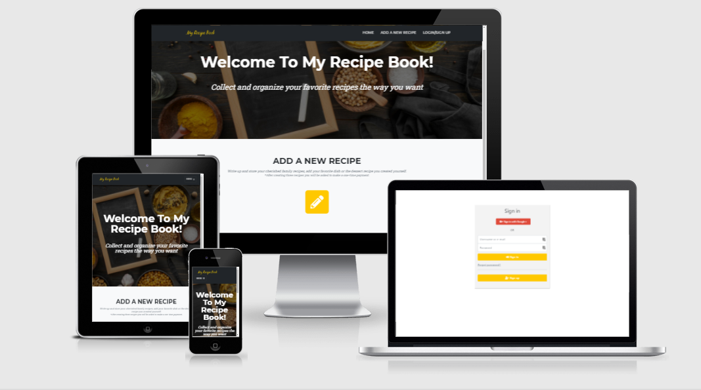

## Contents
- [My Recipe Book site](#my-recipe-book-site)
- [UX](#ux)
- [Database Schema](#database-schema)
- [Technologies Used](#technologies-used)
- [Testing](#testing)
- [Deployment](#deployment)
- [Credits](#credits)

# My Recipe Book site 
My Recipe Book represents a full-stack web application that uses the relational database PostgreSQL, the Django full stack MVC framework. The project also includes setup of the authentication mechanism and checkout system.

# UX

## Who is this website for?
For users who want to create and manage their recipes online.

## What it is that they want to achieve?
They need a simple way to write down new cooking recipes in an online recipe book, be able to find them, edit or delete.

## How does the project fulfil the users’ needs?
The implementation provides intuitive user interface for creation of new recipes. The website requests users to be authenticated and authorised in order to manage their own recipes. Add recipe page lists all necessary fields for writing a new recipe, e.g. recipe name, course name, ingredients, preparation steps and time. Additionally image upload option is available for users. For quick and easy search, users can use either the course cards from Home page or the search field and 'Filter by Course' dropdown located on My recipes page. Each recipe can be modified and removed. The site is functioning on desktop as well as on mobile devices.

## Wireframes
The [wireframes](https://github.com/AnaStasia1331/ms4-recipe-book/tree/master/static/img/readme/wireframes) were created using Balsamiq tool.

## User Stories 
As a website user, I want to:

1. access the website as an anonymous user and understand what it offers to users.
2. be able to create a new account.
3. be able to log into an existing account.
4. be able to reset password.
5. use the Google authentication to sign into the website account.
6. be able to log out.
7. be able to add/edit/delete recipes when I'm logged in.
8. see only my own recipes.
9. find an existing recipe based on the category/group it belongs to.
10. search recipes via the search field.
11. make one-time secure payment for using the website.
12. my recipes are not visible when I'm an anonymous user.
13. access the website from multiple devices of different sizes without major UI issues.

## Nice-to-have features 

1. User settings page with the option to edit username or email address and the reset password functionality. 
2. As the next stage it could be the possibility to share recipes with other users.

# Database Schema 

Heroku deployment uses the PostgreSQL relational database, whereas in the development mode the project runs on SQLite3 provided within the Django framework.

The database schema:

# Technologies Used

The below list includes all of the languages, frameworks, tools, learning platforms and stock image websites I have used to create this project. 
- [HTML](https://en.wikipedia.org/wiki/HTML5)
- [CSS](https://en.wikipedia.org/wiki/CSS)
- [JavaScript](https://en.wikipedia.org/wiki/JavaScript)
- [Jquery](https://jquery.com/)
- [Bootstrap](https://getbootstrap.com/docs/5.0/getting-started/introduction/) 
    - imported and modified a free bootstrap theme ['Agency'](https://startbootstrap.com/theme/agency)
- [Bootstrap filestyle plugin](https://markusslima.github.io/bootstrap-filestyle/)
    - used for styling and validation of the image upload
- [Python](https://www.python.org/downloads/release/python-3811/)
- [Django - Python based webframework](https://www.djangoproject.com/)
- [SQLite database](https://docs.djangoproject.com/en/3.2/ref/databases/#sqlite-notes)
- [Django allauth for user authentication](https://django-allauth.readthedocs.io/en/latest/installation.html)
- [Gunicorn - Python WSGI server for UNIX](https://docs.djangoproject.com/en/3.2/howto/deployment/wsgi/gunicorn/)
- [Pillow plugin - Imaging Library](https://pillow.readthedocs.io/en/stable/)
- [Stripe payment system](https://stripe.com/docs)
- [Google cloud platform -> API console](https://console.cloud.google.com/)
    - used for setting up Google authentication
- [Gmail as SMTP server](https://mail.google.com/)
    - for sending out verification/reset password and other emails 
- [Heroku](https://dashboard.heroku.com/apps)
    - used for the deployment of the website
    - [Heroku Postrgres add on](https://elements.heroku.com/addons/heroku-postgresql)
- [Git](https://git-scm.com/)
- [GitHub](https://github.com/)
- [Gitpod](https://www.gitpod.io/)
- [Bootsnip](https://bootsnipp.com/snippets/GavAo)
    - for the example of the Login/Register form 
- [Unsplash](https://unsplash.com/)
- [DesignEvo Free Logo Maker](https://www.designevo.com/)
- [Flaticon](https://www.flaticon.com) 
- [Pinetools](https://pinetools.com/darken-image)
- [Google fonts](https://fonts.google.com/specimen/Quicksand)
- [Fontawesome](https://fontawesome.com/)
- [Balsamiq](https://balsamiq.com/wireframes/)
- [ColorPick Eyedropper](https://chrome.google.com/webstore/detail/colorpick-eyedropper/ohcpnigalekghcmgcdcenkpelffpdolg)
- [Chrome dev tools](https://developers.google.com/web/tools/chrome-devtools)
- [Code Institute learning platform](https://codeinstitute.net/)
- [W3schools](https://www.w3schools.com/)
- [Geekforgeeks](https://www.geeksforgeeks.org/)
- [Stack Overflow](https://stackoverflow.com/)
- [JavaScript validator](https://jshint.com/)
- [Jigsaw](https://jigsaw.w3.org/css-validator/validator)
- [W3C validator](https://validator.w3.org/)
- [Python formatter](http://pep8online.com/)