1. Anonymous user can access the Home page.    
    1.1. Expected: anonymous user can access the Home page where s/he sees only Home, Add a new recipe, Login/Sign Up navbar items and ADD A NEW RECIPE section.    
    1.1. Testing: Open a new browser tab, access the url https://ms4-recipe-book.herokuapp.com/ -> Home page is displayed as described in the expected result.
    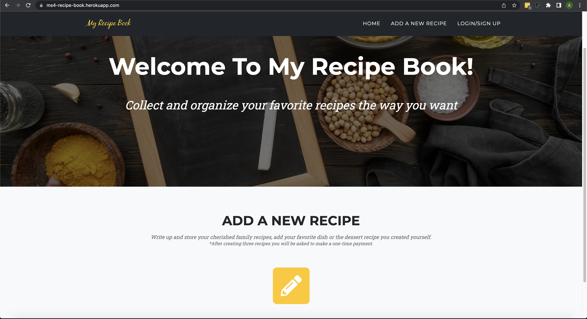    
    1.2. Expected: when anonymous user tries to create a new recipe he will be redirected to the Login/Sign Up page.    
    1.2. Testing: 1. Select the navbar item Add a new recipe -> Login/Sign Up page is opened. 2. Click on the pencil icon in the ADD A NEW RECIPE section -> Login/Sign Up page is opened.    
    1.3. Expected: anonymous user is properly informed what is the purpose of the website and what are the terms of using it.    
    1.3. Testing: Home page header displays the text informing that it's an online recipe book where user can collect and organize her/his favorite recipes on the website. ADD A NEW RECIPE section indicates that after creating 3 recipes, user will be asked to pay once.    
2. Unregistered user can create a new account.    
    2.1. Expected: user can access the Sign Up page by clicking the Sign Up button on the Login page.    
    2.1. Testing: From the Home page click on the Login/Sign Up link in the navbar -> user is redirected to the Sign In page. Press 'Sign Up' button on the Sign In form -> user is redirected to the Sign Up form.    
    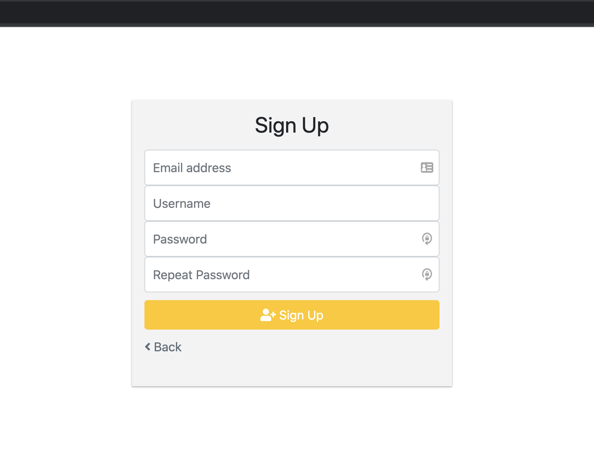   
    2.2. Expected: user can return to the Sign In/Login page from the Sign Up page.    
    2.2. Testing: 1. From the Sign Up page click the Back link -> the Sign In page is loaded. 2. On the Sign In page press the Sign Up button, then press back browser button -> the Sign In page is loaded.    
    2.3. Expected: user cannot create account with already existing email address.    
    2.3. Testing: On the Sign Up form fill in all fields with valid values, but the email address must exist in db, press the Sign Up button -> The account is not created. User still sees the Sign Up form reset and with the message 'A user is already registered with this e-mail address.'   
    2.4. Expected: user cannot create account with invalid email address.    
    2.4. Testing: On the Sign Up form type invalid email address, e.g. without @ symbol (test.com), validate the field -> user is notified that the entered email is invalid and @ is missing.    
    2.5. Expected: user cannot create account with empty email address/usename/password fields.    
    2.5. Testing: First, leave the email field empty, then add it and leave the username/password blank -> All form fields are mandatory and when not filled in, user is shown the message 'Please fill in this field.'    
    2.6. Expected: user cannot create account with the username lengh less than 5 charachters.    
    2.6. Testing: Enter a username consisting of 3 characters and validate -> The account is not created. User still sees the Sign Up form reset and with the message 'Ensure this value has at least 5 characters (it has 3).'    
    2.7. Expected: user cannot create an account when password entered twice mismatches.    
    2.7. Testing: Enter 1st password, then enter the 2nd password but it must be a different than the 1st one -> The account is not created. User still sees the Sign Up form reset and with the message 'You must type the same password each time.'   
    2.8. Expected: user can create a new account on My Recipe Book website if all entered fields were entered correctly.    
    2.8. Testing: 1. Add valid email/username, mathching passwords and press the Sign Up button. -> User is redirected to another page with the message telling to verify the email. 2. Open the email box and check if the Confirm email is received. -> The email is received with the subject 'Please Confirm Your Email Address'. 3. Click on the link from the email. -> User is redirected back to the website to the Confirm Email page. 4. Press the 'Confirm' button. -> User is redirected to the Login page where s/he can enter his credentials and successfully login (sees the Home page).    
    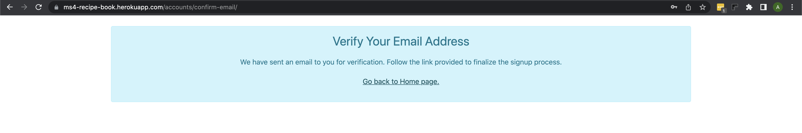   
    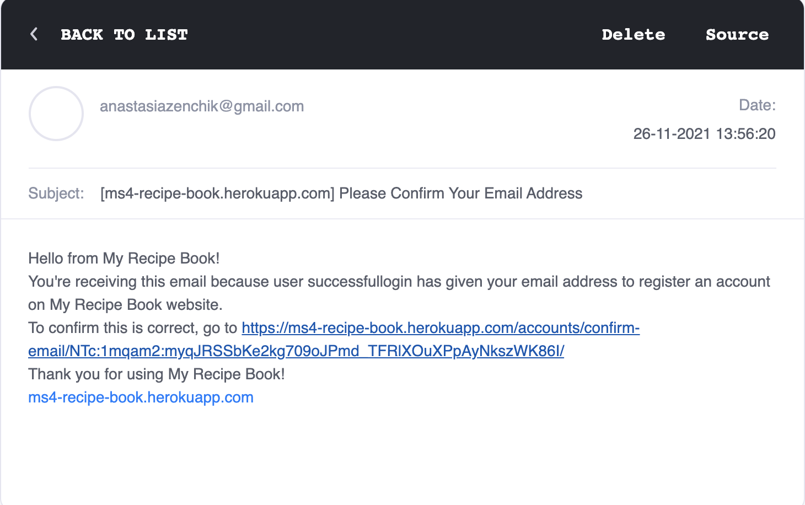   
    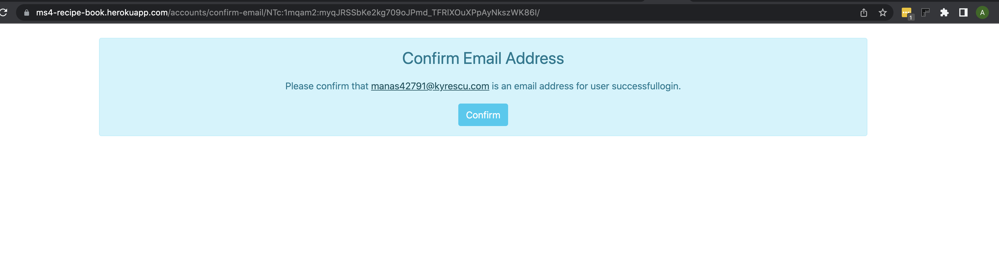   
3. Registered user can sign into her/his account.    
    3.1. Expected: anonymous can access the Login page.    
    3.1. Testing: From the Home page click on the Login/Sign Up link in the navbar. -> The Login/Sign In form is opened.    
    3.2. Expected: user cannot log in, if s/he uses wrong username or password.    
    3.2. Testing: 1. On the Sign In page enter unregistered username and valid password, press the Sign In button. -> User is not logged, instead s/he sees 'The username and/or password you specified are not correct.'. 2. Repeat the previous test only with wrong password -> The expected result should be the same.    
    3.3. Expected: username and password are mandatory fields to fill in.
    3.3. Testing: Leave username/password blank and try to log in. -> 'Please fill in this field' message is shown to the user.    
    3.4. Expected: user can login successfully when using valid credentials.        
    3.4. Testing: Enter valid username and password and click the Sign In button. -> User is sent to the Home page and in the navbar s/he can see 'Welcome, her/his username'.    
4. Existing user can reset password.    
    4.1. Expected: user can trigger password reset.    
    4.1. Testing: As logged out user navigate to the Login Page and click the Forgot Password? link -> The Reset form is shown to the user. The Back link is available on the form that leads back to the Login form.    
    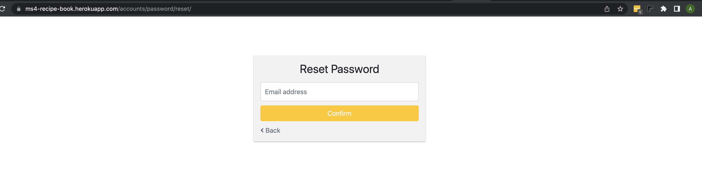  
    4.2. Expected: password cannot be reset if email address is empty.    
    4.2. Testing: Leave the email address field blank and press the Confirm button. -> Password wasn't reset and 'Please fill in this field' message is shown to the user.     
    4.3. Expected: password cannot be reset if email address is invalid.    
    4.3. Testing: Enter invalid email addresss (test"!@#@#@com) and press the Confirm button. -> 'Enter a valid email address.' message is shown to the user.     
    4.4. Expected: password cannot be reset if email address wasn't registered before.    
    4.4. Testing: Enter valid but unregistered email address and press Confirm. -> 'The e-mail address is not assigned to any user account' error message is displayed.    
    4.5. Expected: password can be reset successfully if valid and registered before email address is used.    
    4.5. Testing: 1. Enter valid but registered before email address and press Confirm. -> User is redirected to the Successful reset password page and asked to check her/his email box. 2. Check if the reset password email was received by the user. -> The new email with the subject 'Password Reset Email' arrived. 3. Click the reset password link from the email. -> The website is opened and displays the Change Password form. 4. Leave both password fields blank and submit the form. -> 'Please fill in this field' message is shown. 5. Enter mismatching passwords and submit the form. -> The password reset process wasn't completed and the form is reset. BUG: there is no errror message is displayed to the user, the form is just reset. 6. Enter matching password and submit. -> User is redirected to the next page informing that the password was changed successfully. 7. Click the Go back to Login page link and enter valid credentials with the updated password. -> The user can login successfully.    
    4.6. Expected: the reset password link cannot be used twice, after password was reset.    
    4.6. Testing: 1. Come back to the Password Reset email and try to reset the password second time. -> The new page is opened, however user sees the message that the password reset link was invalid, possibly because it has already been used. 2. Staying on the same page, click the link 'Please request a new password reset.' -> Reset Password form is loaded.    
    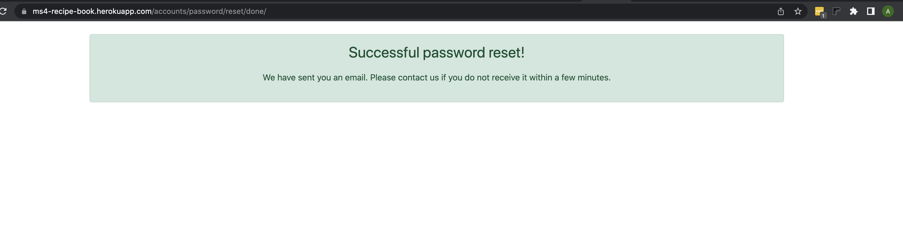    
    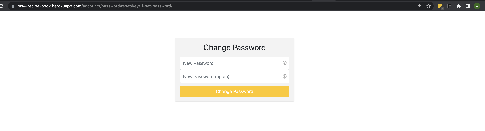    
    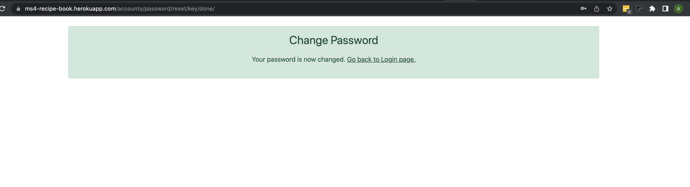  
    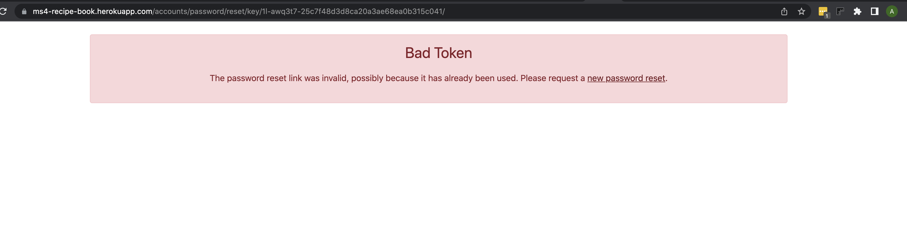    
5. User can log in using her/his Google account.    
    5.1. Expected: user can login to the website when he has an existing Google account but he is currently logged out of it.    
    5.1. Testing: 1. Make sure the user is logged out of her/his Google account, open the website Login page, press 'Sign In With Google' button. -> User is sent to the Google authentication page where he must choose the right account and enter password and depending on the account setup may be asked to go through 2-step verification 2. Sign into the google account. -> At the end user will be automatically redirected to the Home page of My Recipe Book with his username in the header.    
    5.2. Expected: user can login to the website when he has an existing Google account and he is currently logged into it.    
    5.2. Testing: Make sure the user is already log into her/his Google account, open the website Login page, press 'Sign In With Google' button. -> User is automatically redirected to the Home page of My Recipe Book with his username in the header.    
6. User can log out.    
    6.1. Expected: being logged into the website, google authenticated user can log out.    
    6.1. Testing: Sign into the website via Google authentication, click on the Welcome, (username) and select the Logout option. -> Home page is displayed with the updated navbar links: e.g. instead of Welcome, (username) there is Login/Sign Up link.     
    6.2. Expected: being logged into the website, authenticated user can log out.    
    6.2. Testing: Sign into the website in a regular way (by using username and password), click on the Welcome, (username) and select the Logout option. -> Home page is displayed with the updated navbar links: e.g. instead of Welcome, (username) there is Login/Sign Up link.   
7. Uset can add/edit/delete recipes when he is logged in.    
    7.1. Add a new recipe.               
        7.1.1. Expected: logged in user can access the Add a new recipe page.    
        7.1.1. Testing: 1. Make sure the user is logged in, click Add a new recipe link in the nav bar or the pencil icon in the ADD A NEW RECIPE section. -> Add A New Recipe form is opened with 2 buttons: Cancel and Save. 2. When already logged, navigate to this url https://ms4-recipe-book.herokuapp.com/recipes/add/  -> Add A New Recipe form is opened.
        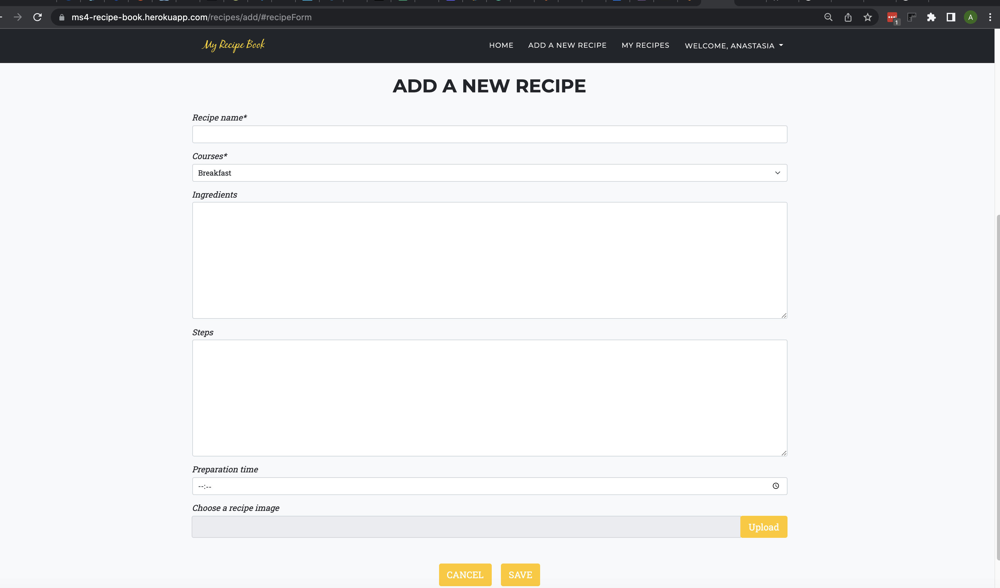        
        7.1.2. Expected: unauthorised user cannot access the Add a new recipe page.    
        7.1.2. Testing: Make sure the user is logged out, navigate to this url https://ms4-recipe-book.herokuapp.com/recipes/add/ -> The user is redirected to the Login page.    
        7.1.3. Expected: when user forgets to add a title to a recipe, the new recipe can't be created.    
        7.1.3. Testing: Leave the Recipe Name field empty and try to save the recipe -> user is asked to fill in the field and the recipe wasn't saved. 
        BUG: 'Please fill in the recipe name field' message appears only when the cursor is located in the field and after pressing the submit key.    
        7.1.4. Expected: recipe name field can include no more than 50 characters.    
        7.1.4. Testing: Try to add recipe name containing more than 50 char.  -> After 50th character typing is not possible.   
        7.1.5. Expected: user can select any course type from the Courses dropdown.    
        7.1.5. Testing: 1. Click the dropdown -> all 6 course types are visible in the dropdown. 2. Select a value from the dropdown -> the correct value is selected.    
        7.1.6. Expected: user can paste/type large amount of text in Ingredients and Steps textarea.    
        7.1.6. Testing: Paste a long text (more than 2000 characters) -> the long text is accepted.    
        7.1.7. Expected: user can set preparation time.    
        7.1.7. Testing: Select a half an hour or an hour as cooking time -> the correct time is set.    
        7.1.8. Expected: user cannot upload image of unsupported format.    
        7.1.8. Testing: Try to upload a gif file. -> The popup appears informing that 'Only files with the following extensions are allowed: jpg, jpeg, png.'. The file wasn't uploaded.
        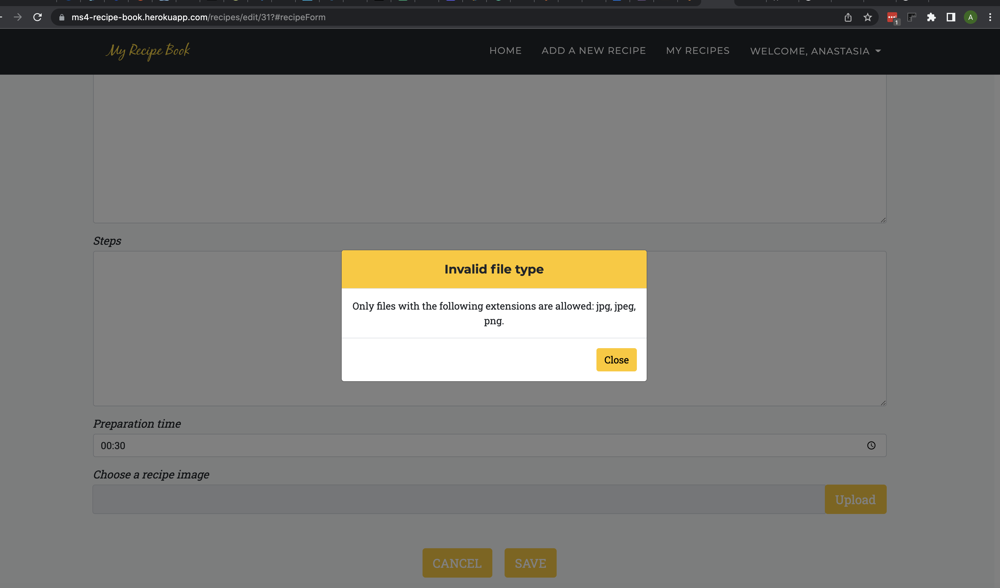        
        7.1.9. Expected: user cannot upload image more than 4MB.    
        7.1.9. Testing: Try to upload file of the size more than 4MB. -> The popup appears informing that 'Maximum file size must be 4MB.'. The file wasn't uploaded.    
        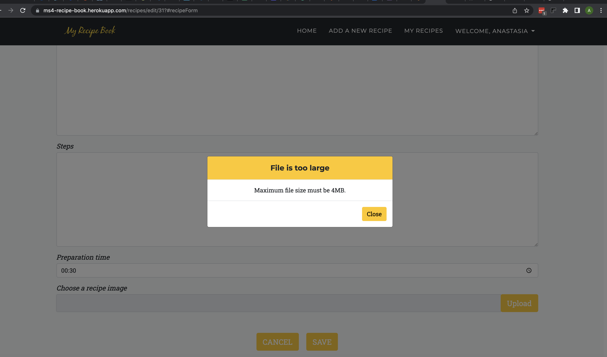    
        7.1.10. Expected: user gets recommendation on image orientation on image upload.    
        7.1.10. Testing: Try to upload image of square or portrait orientation. -> The popup appears informing that 'To ensure your image is best displayed we recommend uploading images in a landscape orientation.'     
        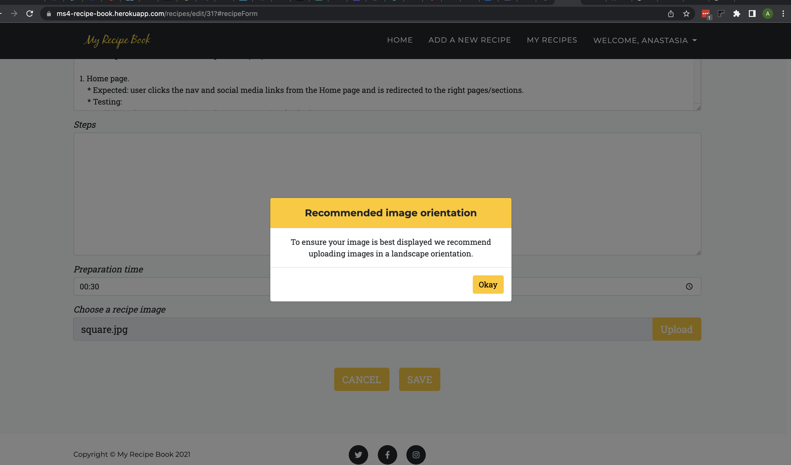    
        7.1.11. Expected: user can cancel the recipe creation.    
        7.1.11. Testing: Click the Cancel button -> from Add a New Recipe form the user is redirected back the page visited earlier.    
        7.1.12. Expected: user can save a new recipe successfully.    
        7.1.12. Testing: Fill in all required and optional fields in the form, upload an image in a landscape orientation and click the Save button. -> User is redirected to My Recipes page, he can find her/his recipe on the page with the correct title, displayed image and the course name. When he opens the recipe, he can see that it contains all text/selection filled in earlier.     
    7.2. Edit an existing recipe.    
        7.2.1. Expected: user is able to update any field of the edit form.     
        7.2.1. Testing: Find an existing recipe, press the Edit icon and try to edit Recipe Name, Courses, Ingredients, Steps, Preparation Time and reupload an image. -> All mentioned places are editable.     
        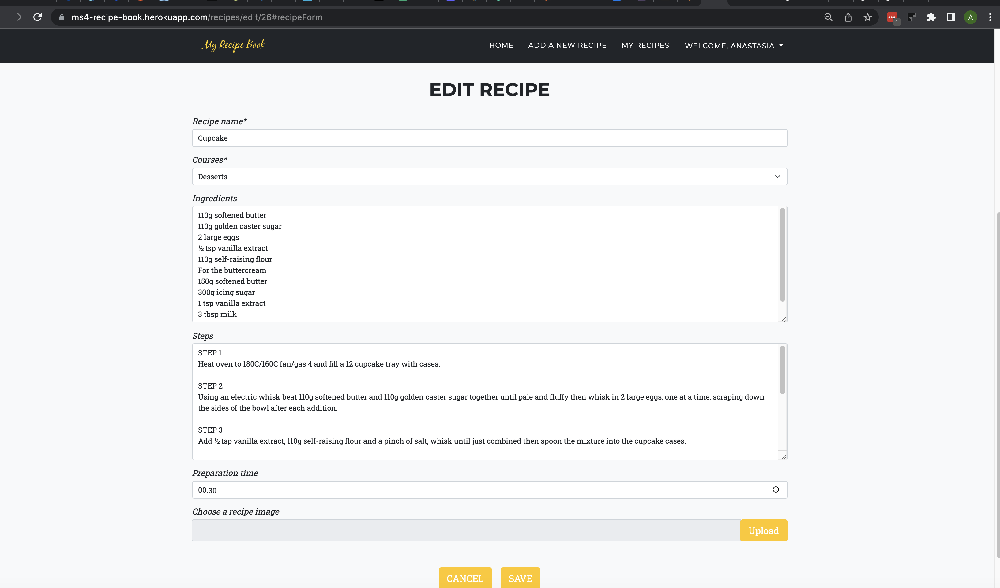       
        7.2.2. Expected: user is able to update the edit form successfully.         
        7.2.2. Testing: Edit Recipe Name, Courses, Ingredients, Steps, Preparation Time, Image and click the Save button. -> User is redirected to My Recipes page, can find her/his recipe (with changed name, course and image) and when press the View or Edit icons s/he can see that the previously made changes were applied.       
        7.2.3. Expected: user is able to cancel form editing.     
        7.2.3. Testing: Edit an existing recipe and click the Cancel button. -> User is redirected to the previously visited page, when he reopens the recipe he can't see the change he made before pressing the Cancel button.     
    7.3. View an existing recipe.    
        7.3.1. Expected: user is able to view an existing recipe but can't update the recipe in the view mode.        
        7.3.1. Testing: Find an existing recipe, press the View icon try to edit Recipe Name, Courses, Ingredients, Steps, Preparation Time, Image -> all mentioned places are for read only and can't be updated.   
        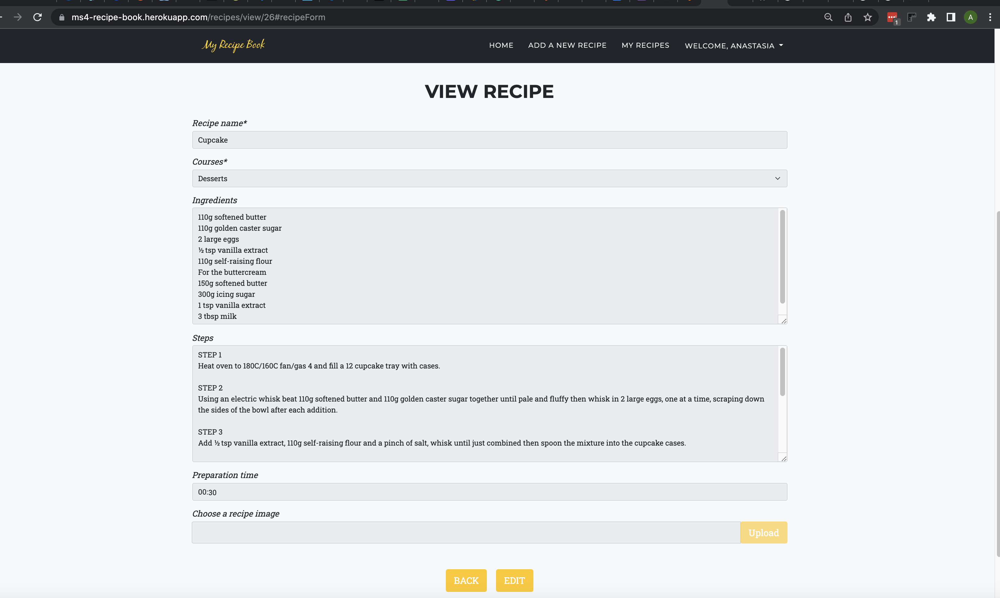           
        7.3.2. Expected: user is able to view an existing recipe and proceed to the edit mode.     
        7.3.2. Testing: Open a recipe in the view mode and press the Edit button. -> User is redirected to the Edit Recipe page for the same recipe.      
        7.3.3. Expected: user is able to view an existing recipe and close the view mode.    
        7.3.3. Testing: Open a recipe in the view mode and press the Back button. -> User is redirected back to the previously visited page.    
    7.4. Delete recipe.     
        7.4.1. Expected: user can select a recipe on My Recipes page and click the Delete icon.     
        7.4.1. Testing: Find an existing recipe, press the Delete icon. -> The Confirm delete popup opens for the selected recipe.    
        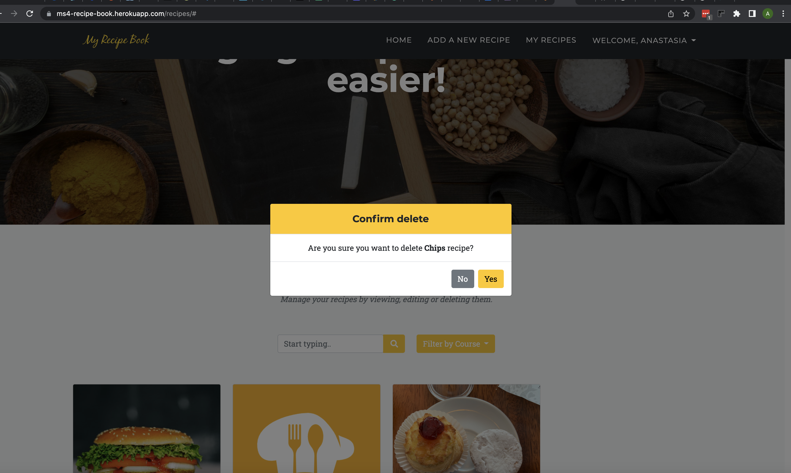           
        7.4.2. Expected: user can delete an existing recipe.    
        7.4.2. Testing: Find an existing recipe, press the Delete icon, confirm the action -> the popup is closed, the recipe has been deleted. It cannot be found on the My Recipes page.    
        7.4.3. Expected: user can cancel the delete action from the Confirm delete popup.       
        7.4.3. Testing: Find an existing recipe, press the Delete icon, cancel the action -> the popup is closed, the recipe has not been removed from the My Recipes page.    
8. User sees only her/his own recipes.
    8.1. Expected: user sees only her/his own recipes.        
    8.1. Testing: 1. Login as user A, create a recipe. -> Recipe is available on My Recipes page. 2. Login as user B, open My Recipes page and check if the recipes of user A can be seen. -> User B cannot see the recipes of user A. BUG: if copy the edit or view urls of a particular recipe of user A and try to navigate to them as user B, you can see the recipe details.     
9. User can find an existing recipe based on the course it belongs to.    
    9.1. Expected: user can filter recipes by course.    
    9.1. Testing: Open My Recipes page, note the course assigned to a particular recipe, e.g. breakfast. Use 'Filter by course' dropdown to select specific course (breakfast). -> Only recipes in the selected course are displayed on the page.       
    9.2. Expected: user can select 'All recipes' in the 'Filter by course' dropdown.       
    9.2. Testing: Open the 'Filter by course' dropdown and select 'All recipes'. -> All existing for this user recipes are shown again.  
    9.3. Expected: user is informed when filtering by course didnt bring any results.       
    9.3. Testing: Open the 'Filter by course' dropdown and select the course that doesnt have any recipe attached. -> No recipes are shown, only the message 'Your search didn't bring back any recipes.'.    
    9.4. Expected: user can filter recipes by selecting a course from the Home page.       
    9.4. Testing: Navigate to the Home page, go to the Course section, click a course card. -> User is sent to My Recipes page with the recipes filtered by the selected course (if exist).    
10. User can search recipes via the search field.    
    10.1. Expected: user can find recipe by entering name/course in the search field.        
    10.1. Testing: Open All Recipes page, enter recipe name or course name (fully or partially) and search. -> The result returns the recipe(s) that has/have matching recipe or course name.    
    10.2. Expected: user can reset the search field results.    
    10.2. Testing: Clear the search field and press the magnifying glass icon. -> All recipes are displayed.   
    10.3. Expected: user is informed when the search didnt bring any results.    
    10.3. Testing:  Enter a non-existing recipe/course name and search. -> No recipes are shown, only the message 'Your search didn't bring back any recipes.'.    